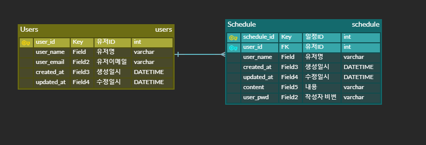
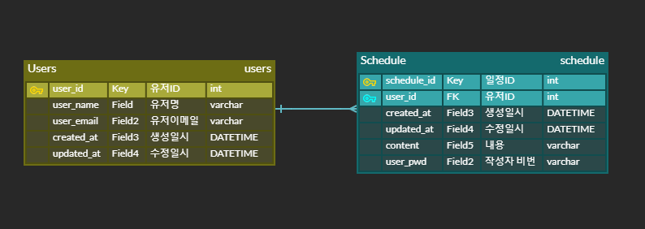

# 📖 Schedule Project

## 💠개요

Schedule Project는 유저정보를 등록 & 일정을 입력받아 클라이언트에서 온 요청을
처리 해주는 서버 입니다. 도전 > 필수로 기능을 확장하면서 전에 있는 요구사항도 반영
할 수 있게 개발 했습니다
---

## UseCase

## #️⃣ 도전

⏹️ 일정 생성

- [ ]  `할일`, `작성자명`, `비밀번호`, `작성/수정일`을 저장
- [ ]  `작성/수정일`은 날짜와 시간을 모두 포함한 형태
- [ ]  각 일정의 고유 식별자(ID)를 자동으로 생성하여 관리
- [ ]  최초 입력 시, 수정일은 작성일과 동일

⏹️ 조회

다음 **조건**을 바탕으로 등록된 일정 목록을 전부 조회

- [ ]  `수정일` (형식 : YYYY-MM-DD)
- [ ]  `작성자명`
- [ ]  조건 중 한 가지만을 충족하거나, 둘 다 충족을 하지 않을 수도, 두 가지를 모두 충족할 수도 있다.
- [ ]  `수정일` 기준 내림차순으로 정렬하여 조회
- [ ]  선택한 일정 단건의 정보를 조회할 수 있습니다.
- [ ]  일정의 고유 식별자(ID)를 사용하여 조회합니다.

## 2️⃣ 필수

⏹️ 연관 관계

- [ ]  작성자 테이블은 `이름` 외에 `이메일`, `등록일`, `수정일` 정보를 가지고 있습니다.
- [ ]  작성자의 고유 식별자를 통해 일정이 검색이 될 수 있도록 전체 일정 조회 코드 수정.
- [ ]  작성자의 고유 식별자가 일정 테이블의 외래키가 될 수 있도록 합니다.

⏹️ 페이지네이션

- [ ]  등록된 일정 목록을 `페이지 번호`와 `크기`를 기준으로 모두 조회
- [ ]  조회한 일정 목록에는 `작성자 이름`이 포함
- [ ]  범위를 넘어선 페이지를 요청하는 경우 빈 배열을 반환

⏹️ 예외처리

- [ ] `@ExceptionHandler`를 활용하여 공통 예외 처리를 구현할 수도 있습니다.
- [ ] 예외가 발생할 경우 적절한 HTTP 상태 코드와 함께 사용자에게 메시지를 전달하여 상황을 관리합니다

⏹️ 데이터 검증

- [ ]  `할일`은 최대 200자 이내로 제한, 필수값 처리
- [ ]  `비밀번호`는 필수값 처리
- [ ]  담당자의 `이메일` 정보가 형식에 맞는지 확인

## 💠 주요 기능

- **....**

- **....**

## 💠 기술 스택

- **언어**: Java
- **DB**: MySql
- **개발 툴**: IntelliJ IDEA
- **프레임워크**: Spring Boot
- **편의 기능**: RomBok,Thymeleaf,Validation,Jdbc

## 💠 API 명세서

| 기능 이름      | Method | Url                                 | Request                                                                                     | Response | Status           |
|------------|--------|-------------------------------------|---------------------------------------------------------------------------------------------|----------|------------------|
| 일정 등록      | POST   | /schedule/v1/schedule               | 요청 body{ "content":"일정내용", "userPwd": "1234","userId": 1}                                   | 등록 정보    | 200: 정상등록 400:오류        |    
| 전체 일정 조회   | GET    | /schedule/v1/schedules              | 요청 param    1. ?userId= //  선택 유저 작성 일정     2. userName=&updatedAt=YYYY-MM-DD //이름,수정날짜로 검색 | 다건 응답 정보 | 200: 정상조회  400:오류       |
| 선택 일정 조회   | GET    | /schedule/v1/schedule/{schedulesId} | 요청 param                                                                                    | 단건 응답 정보 | 200: 정상조회 400:오류        |
| 선택 페이지 조회  | GET    | /v1/schedule/{currentNum}/{pageSize} | 요청 param                                                                                    | 다건 응답 정보 | 200: 정상조회 400:오류        |
| 선택 일정 업데이트 | PATCH  | /schedule/v1/schedule/{schedulesId} | 요청 body{"userPwd": "1234","userName":"6번사람","content": "수정0"}                               | -        | 200: 정상수정 400:오류       |
| 선택 일정 삭제   | DELETE | /schedule/v1/schedule               | 요청 body{"userPwd":"1234"}                                                                   | -        | 200: 정상삭제 400:오류 |
| 유저 등록      | POST | /user/v1/user                       | 요청 body {"userName": "이름입력","userEmail": "이메일@google.com"}                                  | -        | 200: 정상등록        |

## 💠 DB 구조

LV 0,1,2



LV 도전과제



```
굳

```


